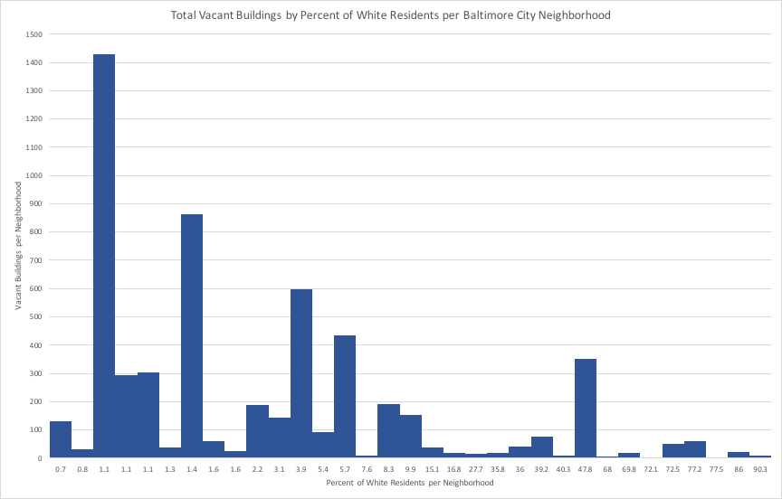
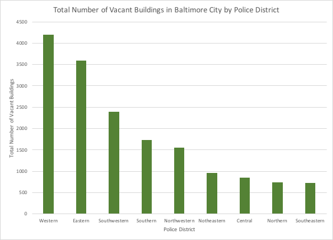
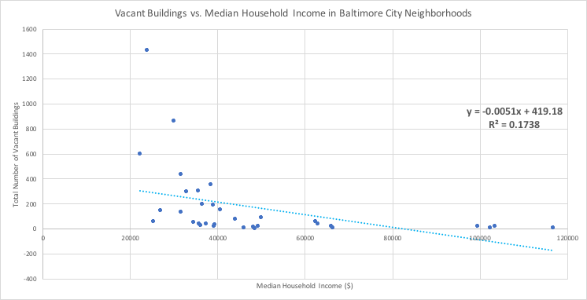
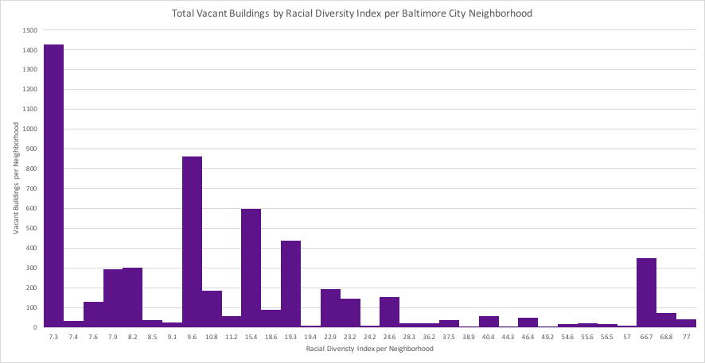

# Analyzing the Distribution of Vacant Buildings in Baltimore City
2-3 sentences that explain your “business question” and some high-level findings and suggestions. This is like the abstract of your executive summary. Tell the reader a little bit about your business question, why this is important, a high-level finding, and the future implications of your findings. This can include some statistics, but shouldn’t dive deep into specifics about your analysis. Make this short and captivating so that the user wants to continue reading about this topic and what you’ve done. You can use bullet points in this section to emphasize some key points or findings that are further explained in the:

## Challenge/problem section
Solution section
Suggestion section
But make sure to surround the bullets with additional context for what the reader is about to encounter in your summary.

## Why is this a Challenge/Problem?
What is your business question and why is this important? This is obviously important to you because you’re working on the project, but why should the reader care about this problem as well? What other other industries (i.e. automotive, public sector, emerging technology), groups (i.e. executives, mechanics, accountants), or demographics (sex, gender, race, location) is this problem relevant for? What’s happening now because of this problem and what are potential bigger problems that can arise from nothing being done about this problem? You can use statistics and numbers to enforce your statements, but make sure to make these accessible to a general audience. Link to your sources, articles, datasets, etc. here for people to read more about specific issues that might be useful. This section should be no longer than a paragraph.

## Your Solution
What’s your business answer and how did you come to this conclusion from your data analysis? What is the impact of your findings? Tell your reader up front what you found, and then support your findings with summary statements about and links to your analysis that you’ve uploaded to your GitHub repository. In some cases, you won’t be able to “solve” the business question because this is related to a larger systemic challenge or something that relies on many outside forces to solve. That’s okay--explain why this might be the case, and use your data analysis to support these statements. Interpret your methods in big-picture analysis, simple linear regression, correlation, multiple linear regression, and clustering into words that a general audience can understand, and relate these findings back to your original business question. Clear data visualizations and data tables can easily help point out trends, outliers, and distributions. Initially you told us why we should care about the problem, now tell us what you, an industry, company, group, demographic, or the reader can do about it based on your analysis. Be specific about your business answer, but don’t get lost in the details. Instead of saying “the trend shows that there is a problem with employment,” specifically point out the decline/increase or use a data visualization to specifically point out problem points. However, don’t get too specific in providing context for your analysis--the audience might want to point out specific significant variables from a linear regression model, but you don’t need to post a screenshot of the result of your full analysis table or list out the prediction equation or exact p-values for each variable. This section is the “meat” of your executive summary, but this shouldn’t be longer than a couple paragraphs.

## Future Suggestions
Now that you told us what needs to happen for your problem as a result of your analysis, how does this come into play in the next 6 months? Year? Ten years? What would you recommend happens in this industry/situation from an organizational, policy, leadership, or some other type of shift or pivot? Why is the future brighter based on this change and why should people care about this? This is similar to a conclusion, but also gives a clear call-to-action to the designated group/people who can do something about your original business question. This section should be about one paragraph.

## Additional Notes and Useful Links:
Exploring your business question
I suggest picking a business question that’s related to Baltimore City, Baltimore City Government as a “business,” or another city government that you may be familiar with as a “business” since most major cities have well-populated open data portals, however, if you wish to explore a different business question, and you can find enough valid data to help you explore this topic, then you may pursue that topic. Here are some resources that might help you explore civic issues in Baltimore City and related resources:

## Data Analysis
While you don’t (and shouldn’t) list out the entirety of your data analysis in your executive summary, you’ll need to upload your excel/Python/other data analysis work to your GitHub profile for a complete project. You don’t need to write up an explanation for each document you upload, but it should be clear what kind of analysis you conducted, why you chose this type of analysis, and your findings from each analysis uploaded. You can also upload data analysis that didn’t directly contribute to your business answer and suggestions to provide a robust background on your research. It should be clear to anyone in the class who isn’t in your group how you came to your data conclusions.

## Executive Summaries
This write-up is similar to a business plan executive summary if your “service” is your business solution. While there are sentence/paragraph suggestions in each section, try to keep the written part of your executive summary to less than 2 pages typed in a Word document. Here are some good resources on business plans to learn more about why they’re important and how you should approach writing them:

Crafting a Powerful Executive Summary, HBS
Executive Summary Template, Forbes
