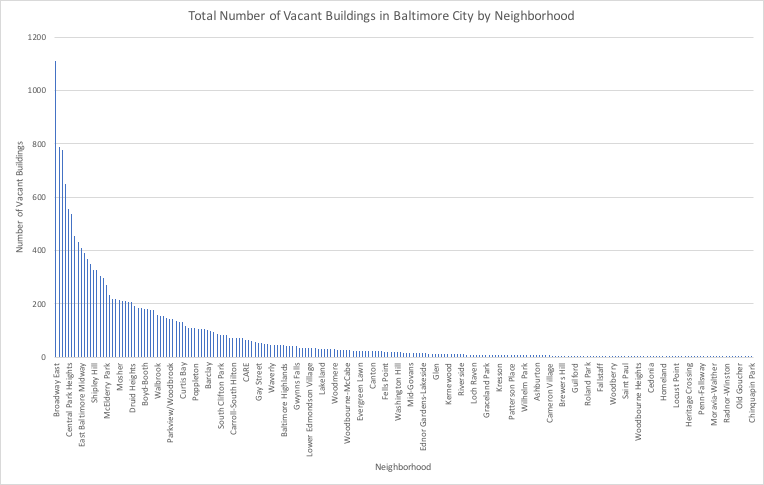
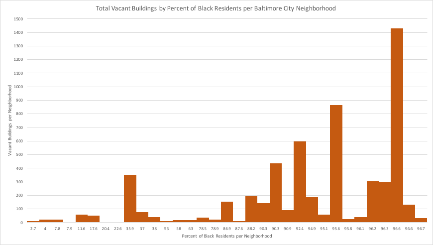

# Analyzing the Distribution of Vacant Buildings in Baltimore City
How can we better understand the relationship between vacant buildings and geographic distribution of race and income? 

The sections below will cover the following: 
* Challenge/Problem Section: History of Baltimore infrastructure and problems residents have experienced  
* Solution Section: Data analysis of number of vacant houses by neighborhood based on race and median income 
* Suggestion Section: Applicaiton of data findings to Baltimore City legislation 

## Why is this a Challenge/Problem? 
The high volumme of vacant buildings present a huge safety and public health problem in Baltimore City. There have been documented cases of vacant buildings collapsing on pedestrians and are detrimental to overall quality of life. 

[INSERT PICTURE OF THE BLACK BUTTERFLY] VS. [INSERT PICTURE OF THE VACANT HOUSES ON MAP]

## Your Solution
### Proposed Policy Solution: 
To put our findings into action, we wanted to focus on strengthening existing Baltimore City legisation. In August 2019, Baltimore Councilman Burnett proposed a new way for Baltimore to hold negligent owners accountable. However, just recently, as of this past March, the Law Department amended the bill to have DHCD as the party responsible for posting the signage instead of the owners themselves. Instead of a paper sign, they must publish a scannable code and phone line rather than a printed address, name, and other contact information which can become outdated after being published.The goal of the vacancy QR codes is to help make slumlord accountable for these empty buildings across the city and make these spaces more accessible to their neighbors. 

How our data can be important:
1) agency can focus on covering certain police districts 
2) focus on neighborhoods within clusters 1 and 3 when making inspection rounds to make the most efficient impact revitalizing the city.

https://www.qrcodepress.com/new-legislation-may-bring-vacancy-qr-codes-to-baltimore/8538335/
https://baltimorefishbowl.com/stories/burnetts-bill-would-force-vacant-property-owners-to-post-a-sign-or-a-pay-a-fine/
https://www.bizjournals.com/baltimore/news/2020/09/21/council-bill-signage-qr-code-vacant-properties.html

What did you find? 

## Future Suggestions
Projections to completely get rid of the house vacancy problem in Baltimore is over a billion dollars (insert link). However, working to efficiently enact this current legislation will reduce time, cost, and effort. According to DHCD, it would cost the agency $39k in the first year for supplies, printing costs, and staff and $14k each year after. Therefore, efficient policy enactment will significantly reduce costs. 

If given more time, we would further analyze more data, information regarding population loss, crime rates by neighborhood, state funding and money allocation based on public health issues. Having access to this information can help 1) see overview of which neighborhoods should be prioritized in terms of development and funding 2) which neighborhoods are getting funding already (needs more), getting funding already (doesn’t need anymore), is not getting funding (needs fundings). 

### Additional Notes and Useful Links:

### Exploring your business question

## Data Analysis

Types of data analysis conducted for each data set: 

[talk about how data and which data sets were combined to produce what - and what analysis was used]

## Executive Summaries
